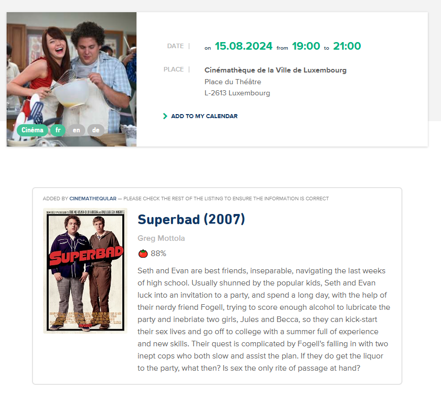

# Cinematheqular <!-- omit from toc -->

*Cinematheqular* is a [user script](https://en.wikipedia.org/wiki/Userscript) that adds a number of features to the website for [Luxembourg city's *Cinémathèque*](https://www.vdl.lu/en/visiting/art-and-culture/cultural-institutions/film/cinematheque).

## Table of Contents <!-- omit from toc -->

- [Features](#features)
- [Screenshots](#screenshots)
- [Install](#install)
- [Caveats](#caveats)

## Features

* Adds short plot summaries to the programme page (English only)
* Adds Rotten Tomatoes ratings to the programme
* Removes the language "badges" from the programme (they are never correct)
* Adds rating and English plot summary to the event's detail page

## Screenshots

## Install

You can use the script with the [Tampermonkey](https://www.tampermonkey.net/) browser extension:

1. Get an API key from [OMDB](https://www.omdbapi.com/apikey.aspx) and activate it
2. Install [Tampermonkey](https://www.tampermonkey.net/) in your browser if you haven't done so already
3. Click [install](./cinematheqular.user.js?raw=1)
4. Go to the [*Cinémathèque* website](https://www.vdl.lu/en/visiting/art-and-culture/cultural-institutions/film/cinematheque) and add your API key when prompted (check the bottom of the screen)

## Caveats

As the title of the listing doesn't always match the title of the film, there will sometimes be no result. The script will remove ending content in brackets from the title as the cinema commonly uses this for extra information but this also means any titles with brackets will not work. Sometimes the result may be for the wrong movie if there are multiple films of the same or similar name. You can check which movie the rating is for by hovering over the rating to see the title, year of release and director.